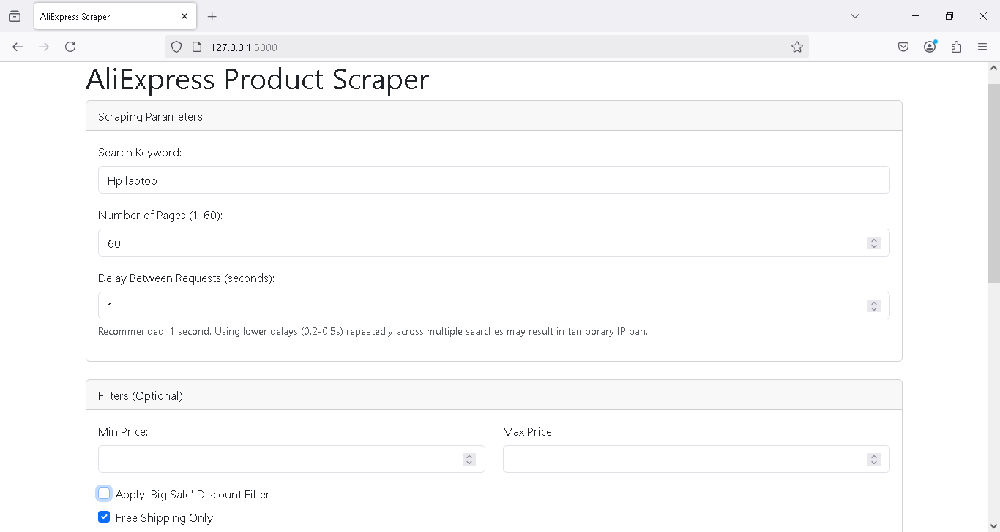
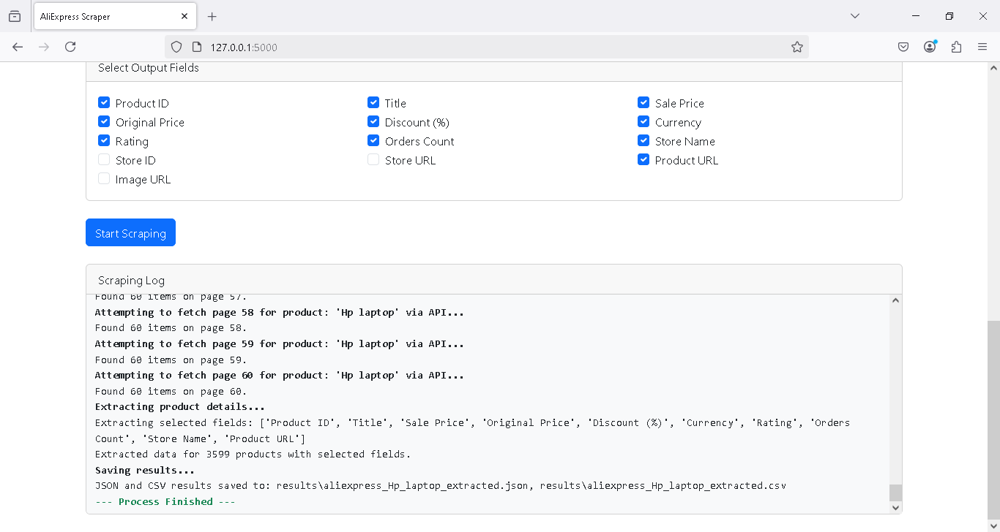

# AliExpress Product Scraper

A powerful and user-friendly web interface for scraping product data from AliExpress using their unofficial API.


## Screenshots

### Search Interface



### Results and Field Selection



## Features

- 🌐 **Web Interface**: Clean and intuitive UI for easy interaction
- 🚀 **API-Based Scraping**: Fast and efficient data collection using AliExpress's unofficial API
- 🔒 **Smart Session Management**: Uses browser automation only for initial cookie collection
- 🛡️ **Anti-Block Protection**:
  - Configurable delay between requests (0.2-10 seconds)
  - Sequential request processing to avoid overwhelming the server
  - Session caching to minimize browser automation
- 📊 **Flexible Data Export**:
  - JSON format for full data preservation
  - CSV format for easy spreadsheet import
- 🎯 **Customizable Fields**: Select exactly which product details to extract
- 🔍 **Advanced Filtering**:
  - Price range filtering
  - Discount deals filter
  - Free shipping filter
- 📝 **Real-time Progress**: Live logging of the scraping process

## How It Works

1. **Smart Session Handling**:
   - First visit uses a headless browser to collect necessary cookies
   - Subsequent requests use cached session data (30-minute validity)
   - Minimizes the need for browser automation

2. **Efficient API Scraping**:
   - Uses AliExpress's internal API for data collection
   - Faster and more reliable than HTML scraping
   - Reduces the chance of being blocked

3. **Data Processing**:
   - Extracts clean, structured data
   - Handles currency formatting
   - Processes URLs and image links
   - Manages pagination automatically

## Installation

1. Clone the repository:

   ```bash
   git clone https://github.com/ImranDevPython/aliexpress-scraper.git
   cd aliexpress-scraper
   ```

2. Install required packages:

   ```bash
   pip install -r requirements.txt
   ```

## Configuration

### Environment Variables Setup

1. Copy the example environment file:

   ```bash
   cp .env.example .env
   ```

2. Edit the `.env` file and add your Oxylabs proxy credentials:

   ```bash
   # Oxylabs U.S. Residential Proxy Configuration
   OXYLABS_USERNAME=your_oxylabs_username_here
   OXYLABS_PASSWORD=your_oxylabs_password_here
   OXYLABS_ENDPOINT=pr.oxylabs.io:7777
   ```

**Note**: The scraper uses Oxylabs U.S. residential proxy for enhanced reliability and store information extraction. Make sure to obtain valid credentials from Oxylabs.

## Usage

1. Start the web interface:

   ```bash
   python app.py
   ```

2. Open your browser and navigate to:

   ```sh
   http://localhost:5000
   ```

3. In the web interface:

   - Enter your search keyword
   - Select number of pages to scrape (1-60)
   - Choose which fields to include
   - Set optional filters (price range, discounts, shipping)
   - Adjust request delay (recommended: 1 second)
   - Start scraping and monitor progress

4. Results will be saved in the `results` folder as:

   - `aliexpress_[keyword]_extracted.json`
   - `aliexpress_[keyword]_extracted.csv`

## Available Fields

- Product ID
- Title
- Sale Price
- Original Price
- Discount (%)
- Currency
- Rating
- Orders Count
- Store Name
- Store ID
- Store URL
- Product URL
- Image URL

## Best Practices

1. **Request Delay**:
   - Default: 1 second between requests
   - Lower values (0.2-0.5s) may work but risk temporary IP blocks
   - Adjust based on your needs and risk tolerance

2. **Page Count**:
   - Maximum: 60 pages per search
   - Recommended: Start with fewer pages to test
   - Use filters to get more relevant results

3. **Session Management**:
   - Session data is cached for 30 minutes
   - Clear browser cookies if you encounter issues
   - Let the automated browser handle cookie collection

## Contributing

Contributions are welcome! Please feel free to submit a Pull Request.

## License

This project is licensed under the MIT License - see the [LICENSE](LICENSE) file for details.

## Disclaimer

This tool is for educational purposes only. Use responsibly and in accordance with AliExpress's terms of service.
